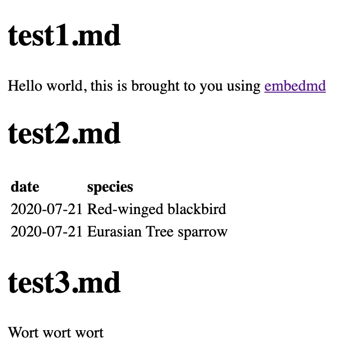

# embedmd - embed Markdown into Markdown or HTML

`embedmd` is a command line tool to embed Markdown within
other documents. Right now you can embed Markdown within other
Markdown documents as well as embed markdown within HTML documents.

This tool utilizes the
[Python-Markdown](https://python-markdown.github.io/) package.

## Installation

```
pip install embedmd
```

or

```
pip install git+https://github.com/kylepollina/embedmd
```

## Embed Markdown within HTML

Place this text in your HTML file where you want to embed Markdown:

```html
<#INCLUDE filename.md>
```

Where `filename.md` is pointing to the Markdown file you wish to embed
in that spot of the HTML file. Then, run the tool from the command line.

```shell
embedmd input.html
```

## Embed Markdown within other Markdown

Place this text in your Markdown file where you want to embed markdown:

```Markdown
[#INCLUDE filename.md]
```

Where `filename.md` is pointing to the Markdown file you wish to embed
in that spot of the HTML file. Then, run the tool from the command line.

```shell
embedmd input.md
```

## Example

Say we have this HTML file...

```html
<!-- template.html -->

<!DOCTYPE html>
<html>
  <head>
    <meta charset="UTF-8">
  </head>
  <body>
    <div id="container">

      <#INCLUDE test1.md>

      <#INCLUDE test2.md>

    </div>
  </body>
</html>
```

... and we want to embed these Markdown documents within.

```Markdown
# test1.md

Hello world, this is brought to you using [embedmd](https://github.com/kylepollina/embedmd)
```

```Markdown
# test2.md

| date       | species
| :-----     | :-------
| 2020-07-21 | Red-winged blackbird
| 2020-07-21 | Eurasian Tree sparrow

#include "test3.md"
```

```Markdown
# test3.md
Wort wort wort
```

Running the `embedmd` command:

```
embedmd template.html
```

will print out

```html
<!-- template.html -->

<!DOCTYPE html>
<html>
  <head>
    <meta charset="UTF-8">
  </head>
  <body>
    <div id="container">

      <h1>test1.md</h1>
<p>Hello world, this is brought to you using <a href="https://github.com/kylepollina/embedmd">embedmd</a></p>

      <h1>test2.md</h1>
<table>
<thead>
<tr>
<th align="left">date</th>
<th align="left">species</th>
</tr>
</thead>
<tbody>
<tr>
<td align="left">2020-07-21</td>
<td align="left">Red-winged blackbird</td>
</tr>
<tr>
<td align="left">2020-07-21</td>
<td align="left">Eurasian Tree sparrow</td>
</tr>
</tbody>
</table>
<h1>test3.md</h1>
<p>Wort wort wort</p>

    </div>
  </body>
</html>
```

-------

-------

### License

MIT License
Copyright Kyle Pollina

Permission is hereby granted, free of charge, to any person obtaining a copy of this software and associated documentation files (the "Software"), to deal in the Software without restriction, including without limitation the rights to use, copy, modify, merge, publish, distribute, sublicense, and/or sell copies of the Software, and to permit persons to whom the Software is furnished to do so, subject to the following conditions:

The above copyright notice and this permission notice shall be included in all copies or substantial portions of the Software.

THE SOFTWARE IS PROVIDED "AS IS", WITHOUT WARRANTY OF ANY KIND, EXPRESS OR IMPLIED, INCLUDING BUT NOT LIMITED TO THE WARRANTIES OF MERCHANTABILITY, FITNESS FOR A PARTICULAR PURPOSE AND NONINFRINGEMENT. IN NO EVENT SHALL THE AUTHORS OR COPYRIGHT HOLDERS BE LIABLE FOR ANY CLAIM, DAMAGES OR OTHER LIABILITY, WHETHER IN AN ACTION OF CONTRACT, TORT OR OTHERWISE, ARISING FROM, OUT OF OR IN CONNECTION WITH THE SOFTWARE OR THE USE OR OTHER DEALINGS IN THE SOFTWARE.
